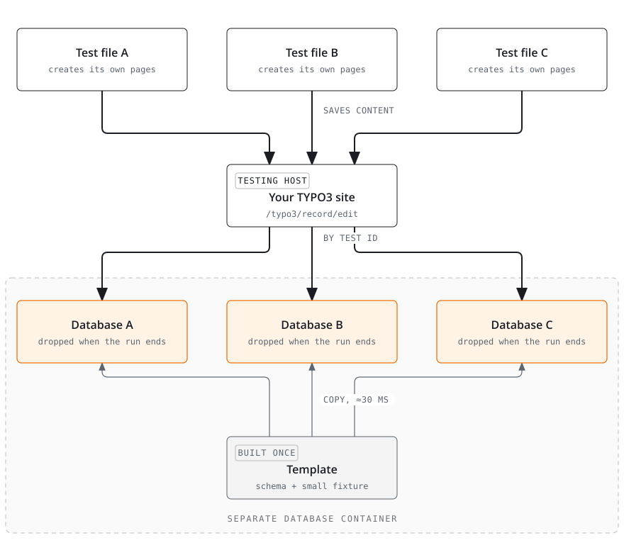

<p align="center">
  
</p>
<h1 align="center">typo3-playwright-toolkit</h1>
<p align="center"><em>Playwright end-to-end tests for TYPO3, with one test database per test file.</em></p>
<br>

<p align="center">
  <a href="https://github.com/plan2net/typo3-playwright-toolkit/actions/workflows/checks.yml"></a>
  <a href="https://github.com/plan2net/typo3-playwright-toolkit/actions/workflows/e2e.yml"></a>
  <a href="https://get.typo3.org"></a>
  <a href="https://www.php.net"></a>
  <a href="https://playwright.dev"></a>
  <a href="LICENSE"></a>
</p>

## The idea

Most TYPO3 end-to-end suites keep their content in one SQL fixture file that the whole
team edits. Two people adding tests pick uids by hand in the same `pages.sql`, and git
cannot merge that: the numbers mean something, so both halves of a conflict can look
right and match neither test. The same shared database also makes tests run one after
another, and a test that changes something can break the next one.

This toolkit takes the content out of the fixture and puts it into the test file.
**Each test file creates its own pages and content, the same way the TYPO3 backend
saves a record when you click Save, and gets a database of its own to write them
into.** TYPO3 builds a template database once, from your schema and a fixture that
holds only what every test needs, and copies it for each test file in about thirty
milliseconds. The database is dropped when the run ends.

So a new test is a new file, and nobody else's lines move. The fixture stops growing
with the suite, and the merge conflicts over uids stop with it. Tests also run at the
same time without touching each other.

It drives [Playwright](https://playwright.dev) against a [TYPO3](https://typo3.org)
project and is built and tested for [DDEV](https://ddev.com). Only the DDEV add-on
depends on DDEV; the other two packages work without it, as
[Without DDEV](SETUP.md#without-ddev) describes.

## The website

**[plan2net.github.io/typo3-playwright-toolkit](https://plan2net.github.io/typo3-playwright-toolkit/)**
shows the idea on one page.

## What a test looks like

One file is one scenario. The setup function creates the content, and the tests read
it.

```ts
import { defineScenario, expect } from '@plan2net/typo3-playwright-toolkit'

const HEADER = 'Hello from the toolkit'

const test = defineScenario(async ({ builders }) => {
    const page = await builders.page().withTitle('First').withSlug('/first').atParentId(1).create()

    // Every TYPO3 core CType already has a builder. You do not have to register it.
    await builders
        .content()
        .onPage(page.id)
        .ofType('header')
        .configure((content) => content.withHeader(HEADER))
        .create()

    return { slug: page.slug }
})

test('renders what the builders wrote', async ({ page, state }) => {
    await page.goto(state.slug)

    await expect(page.getByText(HEADER)).toBeVisible()
})
```

```bash
ddev playwright test                # all tests
ddev playwright test my-feature     # one file
ddev playwright-ui                  # Playwright UI mode
```

The [npm README](packages/typo3-playwright-toolkit#writing-a-test) documents the
builders: your own content types, file references, child records, and saving several
elements in one request.

## How it works

Every test file gets a 16-character test ID. The toolkit sends it as the request
header `X-Playwright-Test-Id` on every request to the testing hostname. Apache and
nginx pass the header to PHP as `HTTP_X_PLAYWRIGHT_TEST_ID` without extra
configuration, and the extension turns it into a database name. Nothing else is
involved: no web server configuration and no environment variable.
[CONTRACT.md](CONTRACT.md) describes the chain in detail.

<picture>
  <source media="(max-width: 700px)" srcset="diagrams/one-header-one-database-narrow.svg">
  
</picture>

Once per run, `ddev playwright test` has TYPO3 rebuild the template database if your
schema or fixtures changed. An unchanged template is reused, so a run costs no build
time. Once per test file, the toolkit asks TYPO3 for a backend session, and TYPO3
copies the template into that file's database before it boots. At the end, the run
drops only the databases it created, so two runs can happen at the same time.

Content goes through `/typo3/record/edit`, the route the TYPO3 backend posts to when
you save a record, with its request token. There are no SQL fixtures for content and
no clicking in the interface. If a new TYPO3 version changes that route or its field
names, your tests fail and tell you.

The npm package never runs SQL. It sends a test ID and the API secret, and the
extension creates and drops the databases. That is why Node and PHP can run in
different containers.

## Three packages

| Package | Install with | What it gives you |
|---|---|---|
| [DDEV add-on](packages/ddev-typo3-playwright-toolkit) | [`ddev add-on get …`](https://ddev.readthedocs.io/en/stable/users/extend/additional-services/) | the `db-test` database service and the `ddev playwright*` commands |
| [`plan2net/playwright-toolkit`](packages/playwright-toolkit) | [Composer](https://getcomposer.org) | the test databases, the backend session, and the test API |
| [`@plan2net/typo3-playwright-toolkit`](packages/typo3-playwright-toolkit) | [npm](https://www.npmjs.com/package/@plan2net/typo3-playwright-toolkit) | Playwright fixtures, content builders, cleanup, screenshots, [axe](https://github.com/dequelabs/axe-core) |

<picture>
  <source media="(max-width: 700px)" srcset="diagrams/packages-overview-narrow.svg">
  
</picture>

At test time the packages talk to each other only over HTTP. Before the run, the
add-on calls the extension's CLI command to build the template, and the npm package
reads the API secret file the extension wrote.

## Why this design

The builders post to the backend instead of clicking through it. Playwright could open
the TYPO3 backend and fill in the forms the way an editor does, but filling a form
takes several seconds per record, so a setup that builds ten of them adds minutes to
every run. The forms are also fragile. Their markup changes between TYPO3 versions,
and FormEngine builds the fields from your TCA, so a selector that works today can
stop working after an update. The builders send the same fields and the same request
token to the same route, so TYPO3 does the same work.

The save runs as the user the session belongs to, so page
permissions, table access and mounts all apply. A SQL fixture writes the row and asks
none of them. You choose that user with `sessionUserId` in the extension settings. Put
your project's real editor in a fixture with that uid, and your tests can only save
what that editor may save. Without a row of your own, the toolkit writes an admin at
that uid, which is what you want until access itself is the thing you are testing.

## What else a run gives you

- When a test fails, its database is kept and the run prints a link that logs you into
  that database's TYPO3 backend
  ([kept databases](packages/playwright-toolkit#looking-at-a-kept-database)).
- A failing test prints the errors TYPO3 logged while it ran, under the failure itself
  ([TYPO3 errors](packages/typo3-playwright-toolkit#when-something-fails-typo3-says-why)).
- `ddev playwright-replay` runs every scenario's setup into one database, so you can
  browse everything the suite builds in one backend
  ([replay mode](packages/typo3-playwright-toolkit#replay-mode)).
- Screenshot comparison, accessibility checks with axe, and CSP violation checks
  ([screenshots](packages/typo3-playwright-toolkit#screenshots),
  [accessibility](packages/typo3-playwright-toolkit#accessibility-checks),
  [CSP](packages/typo3-playwright-toolkit#csp-violations)).

## Getting started

[SETUP.md](SETUP.md) takes you from nothing to a passing test. Once the extension and
the add-on are installed, `ddev playwright setup` does most of it: it checks the project, writes the
files that are missing, prints the commands only your terminal can run, and builds the
template database.

[`tests/e2e/consumer/`](tests/e2e/consumer) is a small TYPO3 project with every file
the setup asks for. CI installs all three packages into it on every push to `main`, on
TYPO3 13.4 and 14.3, and runs a test that builds a page in the backend and checks that
the frontend shows it. That is the `e2e` badge above. `tests/e2e/run.sh` runs it on
your machine.

## Documentation

| Document | What it covers |
|---|---|
| [SETUP.md](SETUP.md) | the six setup steps, an existing Playwright suite, where browsers and the test run can live, and a setup without DDEV |
| [DDEV add-on README](packages/ddev-typo3-playwright-toolkit) | the `db-test` service, the `ddev playwright*` commands, flags and environment variables |
| [Extension README](packages/playwright-toolkit) | the testing host, database selection, fixtures, extension settings and endpoints |
| [npm README](packages/typo3-playwright-toolkit) | writing tests, builders, batching, screenshots, accessibility, CSP, configuration options |
| [CONTRACT.md](CONTRACT.md) | the wire contract between the three packages |
| [CHANGELOG.md](CHANGELOG.md) | what changed in each release |
