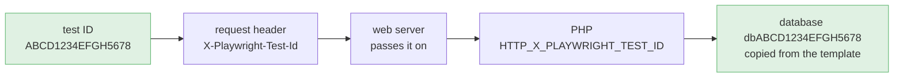
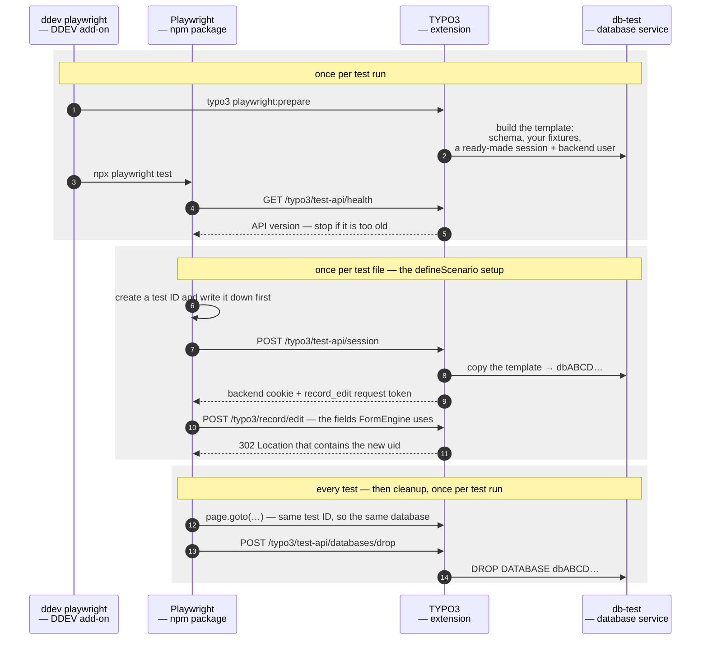

<p align="center">
  
</p>
<h1 align="center">typo3-playwright-toolkit</h1>
<p align="center"><em>Playwright end-to-end tests for TYPO3, with one test database per test file.</em></p>
<p align="center"><a href="https://plan2net.github.io/typo3-playwright-toolkit/"><strong>plan2net.github.io/typo3-playwright-toolkit</strong></a></p>
<br>

[](https://github.com/plan2net/typo3-playwright-toolkit/actions/workflows/checks.yml)
[](https://github.com/plan2net/typo3-playwright-toolkit/actions/workflows/e2e.yml)
[](https://get.typo3.org)
[](https://www.php.net)
[](LICENSE)

Tests run at the same time without sharing data, so they cannot break each other.
Content is created through the real TYPO3 backend, not from SQL fixtures — so a new
test is a new file, and two people writing tests never meet in the same one.

Three packages. You need all three:

| Package | Install with | What it gives you |
|---|---|---|
| [DDEV add-on](packages/ddev-typo3-playwright-toolkit) | `ddev add-on get …` | the `db-test` database service and the `ddev playwright*` commands |
| [`plan2net/playwright-toolkit`](packages/playwright-toolkit) | Composer | the test databases, the backend session, and the test API |
| [`@plan2net/typo3-playwright-toolkit`](packages/typo3-playwright-toolkit) | npm | Playwright fixtures, content builders, cleanup, screenshots, axe |

## How it works

Every test gets a 16-character ID. It is sent as a request header. Apache and nginx
pass that header on to PHP without any extra configuration, and the extension turns
it into a database name:



Nothing sits in between: no web server configuration, no environment variable. This
chain is the whole idea, and `CONTRACT.md` describes it in detail.

The template database is built once per test run from your schema and your fixture
files. Copying it takes milliseconds, so each test can have its own database. At the
end, only the databases this run created are deleted, so two test runs can happen at
the same time.

### A full test run

Each package does one job, and they talk to each other only over HTTP:



Two choices here are on purpose. Content is created through
**`/typo3/record/edit`**, the same route the TYPO3 backend uses when you save a
record, including its request token. No SQL fixtures and no clicking in the
interface. If a new TYPO3 version changes that route or its field names, your tests
fail and tell you, instead of passing while nothing works.

And the npm package **never runs SQL**. It only sends test IDs; the extension deletes
the databases. That is why Node and PHP can run in different containers.

## Setup

```bash
# 1. DDEV add-on — the db-test service and the commands
ddev add-on get https://github.com/plan2net/typo3-playwright-toolkit/releases/latest/download/ddev-typo3-playwright-toolkit.tar.gz
ddev restart

# 2. The extension
ddev composer require --dev plan2net/playwright-toolkit

# 3. The npm package, in a directory of your own for the Playwright tests
ddev exec 'mkdir -p tests/playwright && cd tests/playwright && npm init -y && npm pkg set type=module'
ddev exec 'cd tests/playwright && npm i -D @plan2net/typo3-playwright-toolkit @playwright/test'

# 4. The browsers, in the container that runs the tests
ddev exec 'cd tests/playwright && npx playwright install --with-deps chromium'
```

Step 4 puts the browsers in the web container, which is where `ddev playwright` runs
them. To keep them in a container of their own instead — another architecture, or a
browser image you already have — see [browsers in a container of their
own](packages/ddev-typo3-playwright-toolkit/README.md#browsers-in-a-container-of-their-own).

The `npm init` matters: without a `package.json` of its own, `npm i` walks up and
installs into whatever project it finds above. `type: module` matters because the
config below uses `import.meta.url`.

`tests/playwright` is only the default. To keep your tests somewhere else, put
`PW_TEST_DIR=<your directory>` in the `web_environment` of `.ddev/config.yaml` and
adjust the paths below to match.

Then three files of your own. `tests/playwright/tsconfig.json`, so your editor and
`tsc` can see the package's types — without `NodeNext` resolution everything in your
tests is `any`:

```json
{
    "extends": "@plan2net/typo3-playwright-toolkit/tsconfig.base.json",
    "include": ["**/*.ts"]
}
```

Two files under `config/system/`. TYPO3 loads `additional.php` and nothing else, so
the Testing configuration is reached from there or not at all:

```php
<?php
// config/system/additional.php

if (\TYPO3\CMS\Core\Core\Environment::getContext()->isTesting()) {
    require __DIR__ . '/additional-testing.php';
}
```

```php
<?php
// config/system/additional-testing.php

Plan2net\PlaywrightToolkit\TestContext::applyDatabaseConnectionOverrides();
```

Keep the context check. It is what stops a request carrying a test-ID header from
redirecting the database connection on your ordinary hostname.

> [!NOTE]
> That path is where TYPO3 12.4, 13.4 and 14.3 look under Composer. TYPO3 11.5 loads
> `typo3conf/AdditionalConfiguration.php` instead, and classic-mode 12.4 and 13.4 load
> `typo3conf/system/additional.php`. Only the file name changes.

And `tests/playwright/playwright.config.ts`:

```ts
import { fileURLToPath } from 'url'
import { defineToolkitConfig, defineBasePlaywrightConfig } from '@plan2net/typo3-playwright-toolkit/playwright'

const toolkit = defineToolkitConfig({
    testingURL: 'https://example-testing.ddev.site',
    paths: { consumerRoot: fileURLToPath(new URL('../..', import.meta.url)) },
})

export default defineBasePlaywrightConfig(toolkit, { testDir: './tests' })
```

`testingURL` is the only URL you have to give. It is a second host name that runs in
the Testing context, so your normal project keeps running in Development. You set
that up in your web server; the examples for apache and nginx, and the fixture
files, are in the
**[extension README](packages/playwright-toolkit#testing-host)**.

Everything else has a default value — the
**[npm README](packages/typo3-playwright-toolkit#configure)** lists all of them.

### A working example

Every file above exists in **[`tests/e2e/consumer/`](tests/e2e/consumer)**, a small
TYPO3 project you can copy from.

It cannot go out of date: CI installs all three packages into it on every push to
`main`, on TYPO3 13.4 and 14.3, and runs a test that builds a page in the backend
and checks the frontend shows it. That is the `e2e` badge at the top. Run it
yourself with `tests/e2e/run.sh`.

## Writing a test

One file is one scenario: a setup function that creates content through the real
backend, and the tests that read it.

```ts
import { defineScenario, expect } from '@plan2net/typo3-playwright-toolkit'

const test = defineScenario(async ({ builders }) => {
    const { id, slug } = await builders.page().withTitle('My Page').withSlug('/my-page').create()

    // Every TYPO3 core CType already has a builder. You do not have to register it.
    await builders
        .content()
        .onPage(id)
        .ofType('textmedia')
        .configure((element) => element.withHeader('Hello').withBodyText('<p>Copy.</p>'))
        .create()

    return { slug }
})

test('renders the page title', async ({ page, state }) => {
    await page.goto(state.slug)

    await expect(page.locator('h1')).toHaveText('My Page')
})
```

```bash
ddev playwright test                # all tests
ddev playwright test my-feature     # one file
ddev playwright-ui                  # Playwright UI mode
```

### Two people, two files

A suite on SQL fixtures keeps its content in one file the whole team edits. Two
people adding tests pick uids by hand in the same `pages.sql`, and git cannot merge
that — the numbers mean something, so both halves of a conflict can look right and
match neither test.

Here the content belongs to the test that needs it. A new test is a new file, and
nobody else's lines move.
