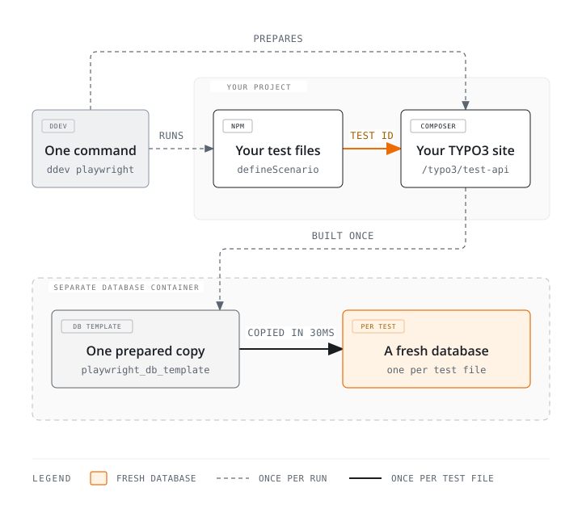

<p align="center">
  
</p>
<h1 align="center">typo3-playwright-toolkit</h1>
<p align="center"><em>Playwright end-to-end tests for TYPO3, with one test database per test file.</em></p>
<p align="center"><a href="https://plan2net.github.io/typo3-playwright-toolkit/"><strong>plan2net.github.io/typo3-playwright-toolkit</strong></a></p>
<br>

[](https://github.com/plan2net/typo3-playwright-toolkit/actions/workflows/checks.yml)
[](https://github.com/plan2net/typo3-playwright-toolkit/actions/workflows/e2e.yml)
[](https://get.typo3.org)
[](https://www.php.net)
[](LICENSE)

Tests run at the same time without sharing data, so they cannot break each other.
Content is created through the real TYPO3 backend, not from SQL fixtures — so a new
test is a new file, and two people writing tests never meet in the same one.

It drives [Playwright](https://playwright.dev) against a [TYPO3](https://typo3.org)
project. [DDEV](https://ddev.com) is what it is built and tested for, and the add-on
below is the shortest way in — but nothing in the other two packages depends on it,
see [Without DDEV](#without-ddev).

Three packages:

| Package | Install with | What it gives you |
|---|---|---|
| [DDEV add-on](packages/ddev-typo3-playwright-toolkit) | [`ddev add-on get …`](https://ddev.readthedocs.io/en/stable/users/extend/additional-services/) | the `db-test` database service and the `ddev playwright*` commands |
| [`plan2net/playwright-toolkit`](packages/playwright-toolkit) | [Composer](https://getcomposer.org) | the test databases, the backend session, and the test API |
| [`@plan2net/typo3-playwright-toolkit`](packages/typo3-playwright-toolkit) | [npm](https://www.npmjs.com/package/@plan2net/typo3-playwright-toolkit) | Playwright fixtures, content builders, cleanup, screenshots, [axe](https://github.com/dequelabs/axe-core) |

<picture>
  <source media="(max-width: 700px)" srcset="diagrams/packages-overview-narrow.svg">
  
</picture>

## How it works

Every test gets a 16-character ID, sent as the request header
`X-Playwright-Test-Id`. Apache and nginx hand it to PHP as
`HTTP_X_PLAYWRIGHT_TEST_ID` without any extra configuration, and the extension
turns it into a database name.

Nothing sits in between: no web server configuration, no environment variable. This
chain is the whole idea, and `CONTRACT.md` describes it in detail.

The template database is built from your schema and your fixture files, and rebuilt
only when those change — an unchanged template is reused, so a run costs no build
time. Copying it takes milliseconds, so each test can have its own database. At the
end, only the databases this run created are deleted, so two test runs can happen at
the same time.

### A full test run

Each package does one job. At test time they talk to each other only over HTTP; the
bootstrap coordinates differently — the add-on calls the extension's CLI command, and
the npm package reads the API secret file the extension wrote:

<picture>
  <source media="(max-width: 700px)" srcset="diagrams/full-test-run-narrow.svg">
  
</picture>

Two choices here are on purpose. Content is created through
**`/typo3/record/edit`**, the same route the TYPO3 backend uses when you save a
record, including its request token. No SQL fixtures and no clicking in the
interface. If a new TYPO3 version changes that route or its field names, your tests
fail and tell you, instead of passing while nothing works.

And the npm package **never runs SQL**. It sends a test ID and the API secret; the
extension creates and deletes the databases. That is why Node and PHP can run in
different containers.

## Setup

**[SETUP.md](SETUP.md)** takes you from nothing to a passing test: the testing
hostname, the three packages, the browsers, the files your project needs, and a first
test that proves it works.

### Without DDEV

DDEV is a convenience, not a requirement. The extension and the npm package do not
read anything DDEV-specific: the extension finds the test database server through
four environment variables, and the npm package only speaks HTTP.

| Variable | Default |
|---|---|
| `PLAYWRIGHT_DB_TEST_HOST` | `db-test` |
| `PLAYWRIGHT_DB_TEST_PORT` | the engine's default port |
| `PLAYWRIGHT_DB_TEST_USER` | `db` |
| `PLAYWRIGHT_DB_TEST_PASSWORD` | `db` |

So the add-on gives you two things you otherwise provide yourself.

**A second database server**, reachable from the web container under those
variables. Point them at a MariaDB, MySQL or PostgreSQL of your own. Copy the
tuning from
[`db-test/`](packages/ddev-typo3-playwright-toolkit/db-test) — `fsync=off` and the
rest — since it is what makes a clone take milliseconds. Give it a volume, not a
tmpfs: test databases grow, and runners run out of memory.

**Five commands**, each a wrapper you can run yourself:

| Command | Runs |
|---|---|
| `ddev playwright test` | `typo3 cache:flush`, `typo3 playwright:prepare`, then `npx playwright test` |
| `ddev playwright-prepare` | `typo3 playwright:prepare` |
| `ddev playwright-ui` | `npx playwright test --ui` |
| `ddev playwright-replay` | `typo3 playwright:replay-prepare`, then `npx playwright test` with `PW_REPLAY=1` |
| `ddev playwright-inspect` | `npx typo3-playwright-inspect` |

Run the `typo3` commands where PHP is, the `npx` ones where Playwright is. They may
be different containers: set `PLAYWRIGHT_TOOLKIT_SECRET` to the same value on both
sides and neither needs the other's filesystem.

One thing stays yours either way, DDEV or not: binding the Testing context to a
separate hostname in your web server. Processed images need no attention — every test
database has its `processingfolder` pointed at `_processed_<testId>`, and cleanup
removes that folder with the database.

What you give up is proof. CI exercises the DDEV path on every push; a setup of your
own is not covered by it.

### A working example

Every file it asks for exists in **[`tests/e2e/consumer/`](tests/e2e/consumer)**, a
small TYPO3 project you can copy from.

It cannot go out of date: CI installs all three packages into it on every push to
`main`, on TYPO3 13.4 and 14.3, and runs a test that builds a page in the backend
and checks the frontend shows it. That is the `e2e` badge at the top. Run it
yourself with `tests/e2e/run.sh`.

## Writing a test

One file is one scenario: a setup function that creates content through the real
backend, and the tests that read it.

```ts
import { defineScenario, expect } from '@plan2net/typo3-playwright-toolkit'

const HEADER = 'Hello from the toolkit'

const test = defineScenario(async ({ builders }) => {
    const page = await builders.page().withTitle('First').withSlug('/first').atParentId(1).create()

    // Every TYPO3 core CType already has a builder. You do not have to register it.
    await builders
        .content()
        .onPage(page.id)
        .ofType('header')
        .configure((content) => content.withHeader(HEADER))
        .create()

    return { slug: page.slug }
})

test('renders what the builders wrote', async ({ page, state }) => {
    await page.goto(state.slug)

    await expect(page.getByText(HEADER)).toBeVisible()
})
```

```bash
ddev playwright test                # all tests
ddev playwright test my-feature     # one file
ddev playwright-ui                  # Playwright UI mode
```

The [npm README](packages/typo3-playwright-toolkit#writing-a-test) documents the
builders in full: your own content types, file references and child records.

### Two people, two files

A suite on SQL fixtures keeps its content in one file the whole team edits. Two
people adding tests pick uids by hand in the same `pages.sql`, and git cannot merge
that — the numbers mean something, so both halves of a conflict can look right and
match neither test.

Here the content belongs to the test that needs it. A new test is a new file, and
nobody else's lines move.

### Why not click through the backend?

Playwright could open the TYPO3 backend and fill in the forms the way an editor does.
The builders post to the backend's own save route instead.

Filling a form takes several seconds per record. A setup that builds ten of them adds
minutes to every run.

The forms are also fragile. Their markup changes between TYPO3 versions, and
FormEngine builds the fields from your TCA, so a selector that works today can stop
working after an update. The test then fails for a reason that has nothing to do with
your site.

And you gain little for the trouble. `/typo3/record/edit` is the route the backend's
own form posts to. The builders send the same fields and the same request token, so
TYPO3 does the same work.

### Permissions are real too

The save runs as the user the session belongs to, so page permissions, table access and
mounts all apply. A SQL fixture writes the row and asks none of them.

You choose that user. `sessionUserId` names a row in `be_users`. Put your project's real
editor in a fixture, give it that uid, and your tests can only save what that editor may
save.

Fixtures are applied before the session is seeded, and the seeded user is written with
`INSERT IGNORE`. So your row wins if you supply one. If you do not, the toolkit writes an
admin at that uid instead, which is what you want until access itself is the thing you
are testing.

## Browsing everything the suite builds

A run puts its content in one throwaway database per test file, then drops them all
when it passes. To see the lot in one place, replay it:

```bash
ddev playwright-replay                   # every scenario
ddev playwright-replay --grep accordion  # a subset
```

Every scenario's setup runs into a single database on the `db-test` container, each
one into a sysfolder named after its file. The tests are skipped: their assertions
and screenshot baselines belong to a per-test database. When the run ends it prints a
link that logs you into that backend.

What comes out is a set of sample pages nobody had to build by hand: one example of
every content element your builders know how to make, ready to click through or
export. The database is rebuilt from the template each time, so nothing piles up, and
the database you develop against is never touched.
